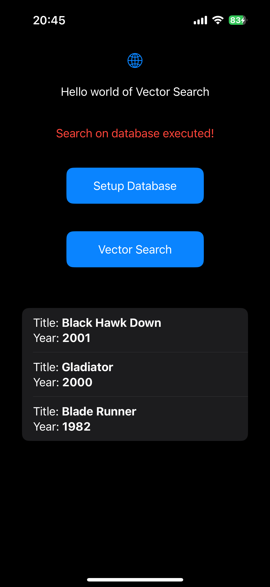

# Turso_iOS
This is an XCode sample project to help build and run Turso's SQLite fork with vector search capabilities on the IPhone. 

It was created for this Medium Post: [From Frustration to Innovation: Building AI-Powered Vector Search on iPhone](https://medium.com/@alessandrocauduro/from-frustration-to-innovation-building-ai-powered-vector-search-on-iphone-996b1502f4aa).


## How to build libsqlite3 for iOS
If you want to rebuild the **libsqlite3_*.dylib** with the latest versions, follow the instructions below.

Make sure to have Xcode and command line tools installed
```bash
xcode-select --install
```
Clone the source code of the project. Currently the vector functionality is only available in the beta branch **"vector"** before it becomes GA.

```bash
git clone --branch vector --depth 1 https://github.com/tursodatabase/libsql.git
```

Build SQLite for Mac (this is needed to generate files for the iOS build)
```bash
cd libsql/libsql-sqlite3 && ./configure && make
```

Finally build SQLite for iOS
```bash
# go back to project folder and run the build script
cd ../..
./build_ios.sh
```

## Xcode
This sample project is already setup and working, but if you want instructions on how to link the dylib, check the original
[Medium Post](https://medium.com/@alessandrocauduro/from-frustration-to-innovation-building-ai-powered-vector-search-on-iphone-996b1502f4aa) 

### Testing

- Click on the "Setup Database" to create a database on device and a sample vector table with data. 
- Click on "Vector Search", if everything is working, this is what it should look like:

